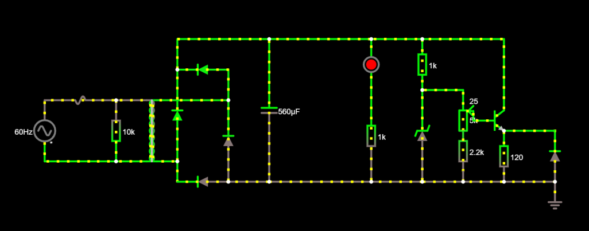
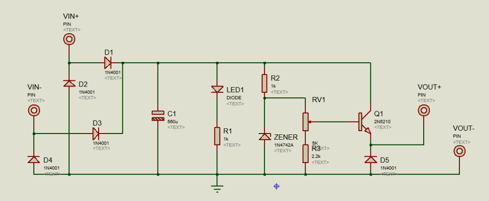

# Projeto-Eletronica-USP

## Projeto desenvolvido para a disciplina de Eletrônica.

## Instruções:

Construção de uma fonte reficadora capaz de transformar corrente alternada de tensão 127 volts em uma corrente contínua, com valor de tensão ajustável entre 3 e 12 volts. 

Teremos a partir da tomada: tensão 127 volts, corrente alternada e frequência de 60 hz.

## Escolha dos componentes:
| Quantidade | Componentes        | Valor R$ |
|------------|--------------------|----------|
| 5x         | Diodo 1N4001       | [R$ 0,15  x  5 = R$0,75](https://www.baudaeletronica.com.br/diodo-1n4001.html) |
| 1          | Capacitor 470uF    | [R$ 0,30](https://www.baudaeletronica.com.br/capacitor-eletrolitico-470uf-25v.html) |
| 1          | Led Vermelho 5mm   | [R$ 0,25](https://www.baudaeletronica.com.br/led-difuso-5mm-vermelho.html) |
| 2          | Resistor 1k ohm    | [R$ 0,08 x 2 = R$0,16](https://www.baudaeletronica.com.br/resistor-1k-5-1-4w.html) |
| 1          | Resistor 120 ohm   | [R$ 0,08](https://www.baudaeletronica.com.br/resistor-120r-5-1-4w.html) |
| 1          | Resistor 2.2k      | [R$ 0,10](https://daeletrica.com.br/resistor-2-2k-1-4w-x10-unidades.html) |
| 1          | Potenciômetro  5k  | [R$ 1,15](https://www.baudaeletronica.com.br/potenciometro-linear-de-5k-5000.html) |
| 1          | Diodo Zener (13v)  | [R$ 0,21](https://www.baudaeletronica.com.br/diodo-zener-1n4743-13v-1w.html) |
| 1          | Transistor NPN     | [R$ 0,18](https://www.baudaeletronica.com.br/transistor-npn-bc548.html) |
| 1          | Transformador      | [R$ 22,99](https://produto.mercadolivre.com.br/MLB-989883391-transformador-trafo-1212v-200ma-bivolt-eletronica-eletrica-_JM?quantity=1#position=1&type=item&tracking_id=9abf8c61-6492-4e02-bb1d-d1a22f9b055d) |
| 1          | Fusível            | [R$ 0,20](https://produto.mercadolivre.com.br/MLB-1215177820-100-pecas-fusivel-vidro-pequeno-5x20-100ma-promoco-_JM?matt_tool=82322591&matt_word&gclid=CjwKCAjw_-D3BRBIEiwAjVMy7KL-xfYxsBZ2ISQ6MRvXKc2D47XdN2jg_2NzGVHaAz0weXOF5UQ18RoCmSgQAvD_BwE&quantity=1) |
 | 1         | Varistor           | [R$ 0,72](https://produto.mercadolivre.com.br/MLB-802196375-50x-varistor-150v-10k-241-_JM?quantity=1#reco_item_pos=1&reco_backend=machinalis-seller-items-pdp&reco_backend_type=low_level&reco_client=vip-seller_items-above&reco_id=6a1c9055-dc87-4ed6-b1dd-cb4f8ae5d41d) |
| **Total**  |                    |  R$ 27,09 |

## Os componentes

* **Transformador**: primeiro componente do circuito após a fonte de corrente alternada (tomada). Será responsável por reduzir de 127v a ddp proveninete da tomada para o valor desejado pela projeto (3-12v). 
O transformador escolhido é capaz de abaixar a tensão de 110 volts para 12 volts.

Obs.: o transformador apenas altera o valor da diferença de potencial entre seus terminais, não alterando de corrente alternada para corrente contínua.
 
* **Fusível**: dispositivo de segurança que impede a passagem de correntes muito alta, protegendo os dispositivos do circuito em eventuais picos de corrente. 

* **Varistor**: dispositivo de segurança que, em conjunto com o fusível, protege contra sobre tensão da rede.

* **Ponte de diodo**: utilizada para que o circuito seja abastecido com a corrente em ambos ciclos da corrente alternada.  

* **Capacitor**: armazena a carga durante os ciclos da corrente alternada, liberando corrente quando a tensão interna é maior que a tensão vinda da fonte. Descarrega quando ocorre a inversão de ciclo. O capacitor foi escolhido para um ripple de 10%, calculando chegamos à um valor de 458uF, foi escolhido o valor comercial próximo de 470uF.

* **Diodo Zener**: regulador de tensão máxima. Somente conduz corrente quando a tensão que chegar alcança a tensão nominal do diodo, que no caso deste projeto, será 12v. Se a tensão for menor do que 12v, o Diodo não conduz e, portanto, não interfere no circuito, se for maior, deixará a corrente passar, mantendo a tensão em 12v naquele ponto.
Informalmente, o diodo Zener “trava” o valor da tensão em 12v, que é exatamente o valor de tensão  máximo que queremos na saída da nossa fonte.

* **Resistores**: complementam o circuito de forma a limitar a corrente e impedindo que a corrente do circuito ultrapasse os valores limites dos componentes.

* **Potenciometro**: resistor variável que permitirá o controle do valor da tensão resultante entre 3 e 12 volts.

* **Transistor**: utilizado para permitir a passagem da corrente de forma ajustável.

## Imagem do circuito

## Link do circuito no Falstad:
http://tinyurl.com/y9jxufk3

## Imagem do circuito esquemático

## Imagem PCB no programa Proteus

## Alunos:
Bernardo Marques Costa [(Odonto)](https://github.com/bmarquescost)

Gabriel Freitas Ximenes de Vasconcelos [(Kibon)](https://github.com/kibonusp)

Mateus Israel [(Capitão)](https://github.com/Mateusrael)

Pedro Augusto Ribeiro Gomes [(França)](https://github.com/parg07)

## Agradecimentos

Agradecemos ao excelentíssimo professor Eduardo do Valle Simões, o Rei.
